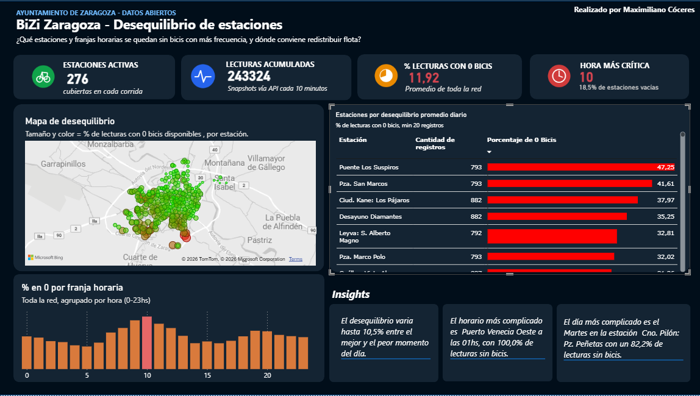

# Bizi Zaragoza — Análisis de Desequilibrio de Estaciones

Proyecto de análisis de datos de punta a punta sobre el sistema de bicicletas públicas Bizi Zaragoza, usando datos abiertos en tiempo real del Ayuntamiento de Zaragoza.

## Pregunta de negocio

¿Qué estaciones y franjas horarias tienen mayor desequilibrio entre demanda y disponibilidad de bicis, y dónde debería el Ayuntamiento redistribuir flota o ampliar estaciones?

## Stack

- **Python** — extracción de datos vía API REST, limpieza y normalización con pandas
- **SQLite** — modelado de datos, consultas SQL
- **Windows Task Scheduler** — recolección automática cada 10 minutos
- **Power BI** — dashboard interactivo con DAX (mapa, ranking, insights dinámicos)

## Pipeline

1. `src/data.py` — conexión a la API de datos abiertos del Ayuntamiento de Zaragoza
2. `analisis/analisis.py` — limpieza, normalización y carga a SQLite (corrida automática)
3. `sql/queries.sql` — consultas de negocio (desequilibrio por estación, por hora, por día)
4. Power BI conectado vía ODBC a la base SQLite

## Resultados (sobre ~230.000 lecturas acumuladas)

- 276 estaciones monitoreadas cada 10 minutos
- 11,9% de las lecturas de toda la red muestran una estación sin bicis disponibles
- La franja más crítica es las 10hs, con 18,5% de estaciones vacías en ese momento
- Ranking de estaciones críticas y patrones por día de la semana disponibles en el dashboard

## Dashboard

## Cómo correrlo

\`\`\`bash pip install -r requirements.txt python analisis/analisis.py \`\`\`

## Autor

Maximiliano Cóceres
